**SENG 438 - Software Testing, Reliability, and Quality**

**Lab. Report #3 – Code Coverage, Adequacy Criteria and Test Case Correlation**

| Group \# 26:   |     |
| -------------- | --- |
| Student Names: |     |
| Truman Yen               |     |
| Ernest Nikolaychuk               |     |
| Rodrigo Amesty               |     |
| Dyson Davis               |     |

**Note: We were told that we were not required to cover all the methods in the two classes.  Reference email below:**
 
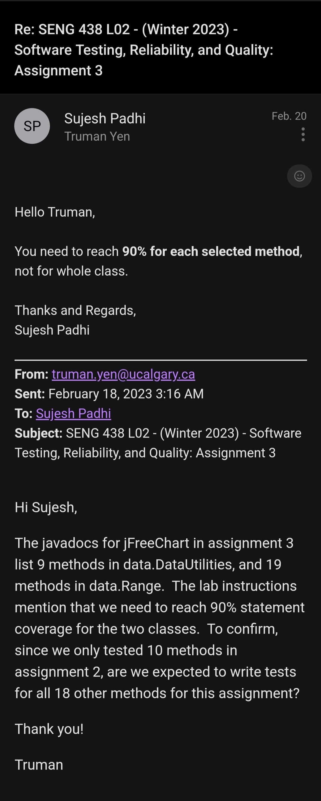
 
# 1 Introduction

In the previous assignment group 26 generated a test suite for jFreeChart, covering five
methods from the Range class and five methods from DataUtilities.  The following is a list
of the selected methods:
- Range:
  - Range(double, double)
  - getCentralValue()
  - getLength()
  - getLowerBound()
  - getUpperBound()

- DataUtilities:
  - calculateColumnTotal(Values2D data, int column)
  - calculateRowTotal(Values2D data, int row)
  - createNumberArray(double[] data)
  - createNumberArray2D(double[][] data)
  - getCumulativePercentages(KeyedValues data)

For this assignment, we have further analysed and improved upon our test suite using code coverage tools such as Eclemma, as well as manual dataflow coverage calculations

# 2 Manual data-flow coverage calculations for X and Y methods

Our group has performed manual calculations for tests written for the following methods:
- calculateColumnTotal(Values2D data, int column)
- getLength()

## 2.1 DataUtilities.calculateColumnTotal() Manual Calculations:
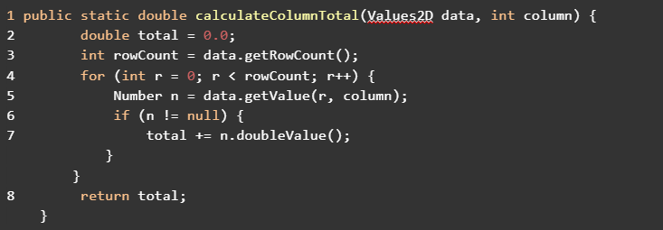
 
Fig.1 Relevant SUT code for calculateColumnTotal
 
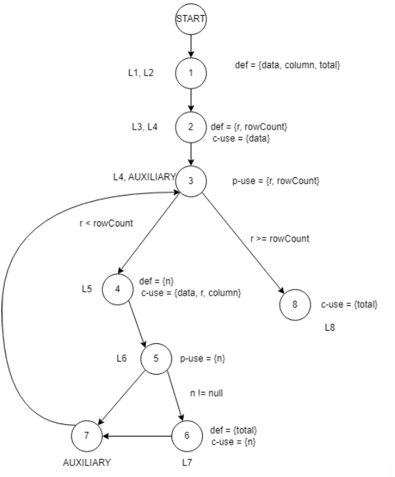
 
Fig.2 Data flow graph for calculateColumnTotal
   

DU pairs for calculateColumnTotal():
|Variable   |Pairs   |
|---|---|
|data   |(1, 2) (1, 4)   |
|column   |(1, 4)   |
|total   |(1, 8) (6, 8)   |
|rowCount   |(2, 3)   |
|r   |(2, 3) (2, 4)   |
|n   |(4, 5) (4, 6)   |

 

DU path sets for calculateColumnTotal():
|Variable   |Path sets   |
|---|---|
|data   |du(1, 2, data) = {[1, 2]}   |
||du(1, 4, data) = {[1, 2, 3, 4]}|
|column   |du(1, 4, column) = {[1, 2, 3, 4]}   |
|total   |du(1, 8, total) = {[1, 2, 3, 8], [1, 2, 3, 4, 5, 7, 3, 8],}   |
||du(6, 8, total) = {[6, 7, 3, 8]}|
|rowCount   |du(2, 3, rowCount) = {[2, 3]}   |
|r   |du(2, 3, r) = {[2, 3]}|
||du(2, 4, r) = {[2, 3, 4]}|
|n   |du(4, 5, n) = {[4, 5]}  |
||du(4, 6, n) = {[4, 5, 6]}|

 

Path coverage of tests for calculateColumnTotal():
|Test|Path covered|Pairs covered|
|---|---|---|
|test_columnTotal_indexOutofBounds()|[1, 2, 3, 4]|rowCount (2, 3) , r (2, 3) (2, 4) data (1, 4) (1, 2)|
|test_columnTotal_indexNegative()|[1, 2, 3, 4]|rowCount (2, 3) , r (2, 3) (2, 4),  data (1, 4) (1, 2)|
|test_columnTotal_positiveSum()|[1, 2, 3, 4, 5, 6, 7, 3, 8],[6,  7, 3, 8]|n (4, 5) (4, 5, 6), rowCount (2, 3) , r (2, 3) (2, 4), data (1, 4) (1, 2)|
|test_columnTotal_negativeSum()|[1, 2, 3, 4, 5, 6, 7, 3, 8],[6,  7, 3, 8]|n (4, 5) (4, 5, 6), rowCount (2, 3) , r (2, 3) (2, 4), data (1, 4) (1, 2)|
|test_columnTotal_zeroSum()|[1, 2, 3, 4, 5, 6, 7, 3, 8],[6,  7, 3, 8]|n (4, 5) (4, 5, 6), rowCount (2, 3) , r (2, 3) (2, 4), data (1, 4) (1, 2)|
|test_columnTotal_decimalValues()|[1, 2, 3, 4, 5, 6, 7, 3, 8],[6,  7, 3, 8]|n (4, 5) (4, 5, 6), rowCount (2, 3) , r (2, 3) (2, 4), data (1, 4) (1, 2)|
|test_columnTotal_nullValues()|[1, 2, 3, 4, 5, 6, 7, 3, 8],[6,  7, 3, 8]|n (4, 5) (4, 5, 6), rowCount (2, 3) , r (2, 3) (2, 4), data (1, 4) (1, 2)|
|test_columnTotal_emptyValues()|[1, 2, 3, 8]|total  (1,8) for  r (2, 3), data (1, 2)|

 

**Coverages**:
 
ADC coverage: 100%. All defines have at least one path to a use. 
 
AUC coverage: 100% for each def all uses are reached. 
 
ADUPC coverage: 100%. All possible paths between defines and uses are covered. 
## 2.2 Range.getLength() Manual Calculations:
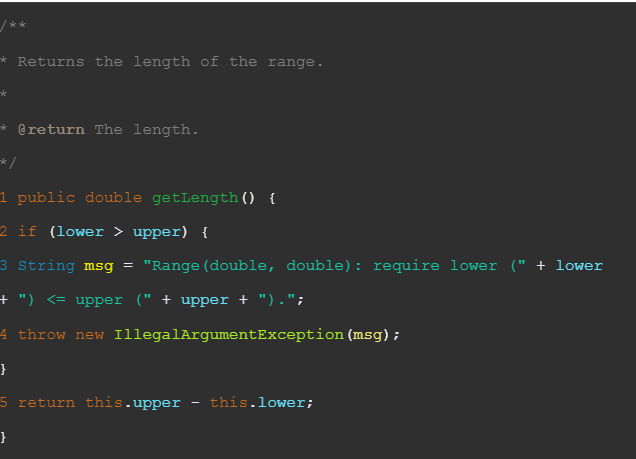
 
Fig.3 Relevant SUT code for getLength()
 
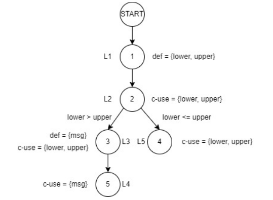
 
Fig.4 Data flow graph for getLength()
   

DU pairs for getLength():
|Variable   |Pairs   |
|---|---|
|lower   |(1, 2) (1, 3) (1, 4)   |
|upper   |(1, 2) (1, 3) (1, 4)   |
|msg   |(3,5)   |

 

DU path sets for getLength():
|Variable   |Path sets   |
|---|---|
|lower   |du(1,2,lower) = { [1,2]}   |
||du(1,3,lower) = { [1,2,3]}|
||du(1,4,lower) = {[1,2,4]}|
|upper   |du(1,2,upper) = { [1,2]}   |
||du(1,3,upper) = { [1,2,3]}|
||du(1,4,upper) = {[1,2,4]}|
|msg  |du(3,5,msg) = {[1,2,3,5]}|

 

Path coverage of tests for getLength():
|Test|Path covered|Pairs covered|
|---|---|---|
|exampleRangeOneLengthTest()|[1,2,4]|du(1,2,lower), du(1,4,lower), du(1,2,upper), du(1,4,upper)|
|exampleRangeOneLengthTest()|[1,2,4]|du(1,2,lower), du(1,4,lower), du(1,2,upper), du(1,4,upper)|
|exampleRangeThreeLengthTest()|[1,2,4]|du(1,2,lower), du(1,4,lower), du(1,2,upper), du(1,4,upper)|

 

**DU-Pair Coverage**:

Feasible du-pairs: 

- du(1,2,lower)
- du(1,4,lower)
- du(1,2,upper)
- du(1,4,upper)

Total = 4

**Infeasible du-pairs**: 
- du(1,3,lower)
- du(1,3,upper)
- du(3,5,msg)

Total = 3

*Total du-pairs = 7*

Covered du-pairs = du(1,2,lower), du(1,4,lower), du(1,2,upper), and du(1,4,upper) - Total = 4
 
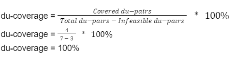

# 3 A detailed description of the testing strategy for the new unit test

In order to increase code coverage, we evaluated our existing test suite and wrote new tests.  This was completed in 4 phases:

Phase 1 (Analysis):
- Manual code coverage calculations were completed and peer reviewed in order to establish increased understanding of SUT implementation
- Used Eclemma in order to more efficiently measure code coverage for remainder of our test suite
- Methods for which the required code coverage was not met were marked for improvement

Phase 2 (Planning):
- Parts of test suite marked for improvement were evaluated by examining SUT source code, noting number of branches/statements missed, in order to develop a plan to enhance the test suite
- Unreachable code blocks were identified; these blocks were temporarily commented out in order to identify feasible ways in which we may improve test suite 
- Additional tests were designed in order to address flaws in existing test suite

Phase 3 (Test development):
- New tests were written according to findings from phase 2

Phase 4 (Peer review):
- Code coverage was measured again with the new  (by other group members) in order to confirm that the new test suite met requirements set out in lab instructions

# 4 A high level description of five selected test cases you have designed using coverage information, and how they have increased code coverage

Addressing branch coverage in DataUtilities.createNumberArray:
- Using eclemma, we identified that we had missed one branch in the method, where a for loop is skipped over because input values are null
- We created a new test createNumberArrayTestNullValues() in order to cover this branch, acheiving 100% branch coverage of reachable code

Addressing overloaded calculateColumnTotal and calculateRowTotal (all rows and some rows):
- Using eclemma and the new javadocs, we identified that the calculateColumnTotal and calculateRowTotal functions had been overloaded in the new version of the SUT
- We generated new test cases test_columnTotal_positiveSum_allValidRows() and test_rowTotal_positiveSum_allValidCols(), in order to test these new overloaded functions in the case that all rows of the array are selected

Addressing branch coverage in overloaded calculateColumnTotal and calculateRowTotal (null values):
- Using eclemma and the new javadocs, we identified that we had not covered the branch in the overloaded functions where data values are null
- We generated new test cases test_rowTotal_positiveSum_overloadedNulls() and test_columnTotal_positiveSum_overloadedNulls().  This increased our branch coverage for these overloaded methods

Addressing more branch coverage in overloaded calculateColumnTotal and calculateRowTotal (no rows/columns selected):
- Using eclemma and the new javadocs, we identified that we had not covered the branch in the overloaded functions where a for loop is skipped because an empty array is provided
- We generated new test cases test_columnTotal_positiveSum_noValidRows() and test_rowTotal_positiveSum_noValidCols().  In these test cases, we used inputs of empty arrays.  The SUT is expected to respond by returning zero.  This increased our branch coverage for these overloaded methods by visiting this branch

Addressing more branch coverage in overloaded calculateColumnTotal and calculateRowTotal (invalid rows/columns selected):
- Using eclemma and the new javadocs, we identified that we had not covered the branch in the overloaded functions where an if statement checks if the provided array of rows/columns is within range of the Data input
- We generated new test cases test_colTotal_positiveSum_invalidRows() and test_rowTotal_positiveSum_invalidCols().  In these test cases, rows/columns that do not exist in the data input are selected.  The SUT is expected to respond to this by ignoring these elemnents.  This increased our branch coverage for these overloaded methods by visiting this branch

# 5 A detailed report of the coverage achieved of each class and method (a screen shot from the code cover results in green and red color would suffice)

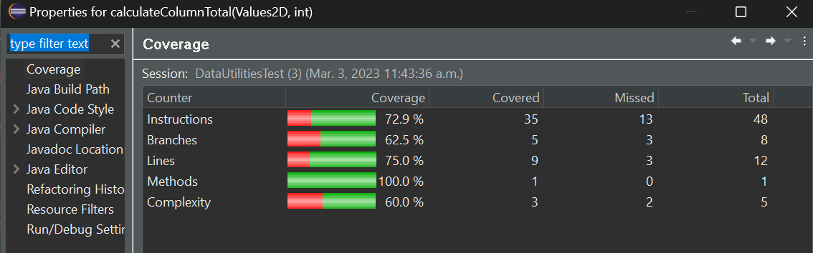
 

**^Unreachable block of code accounts for missing coverage**
 
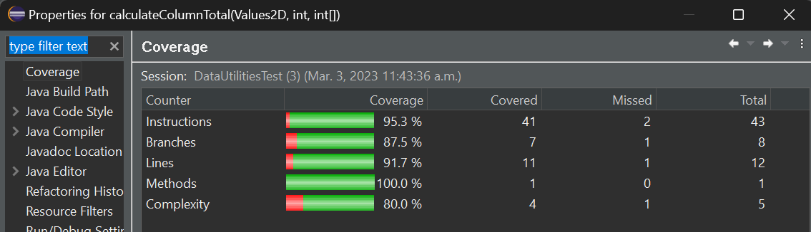
 
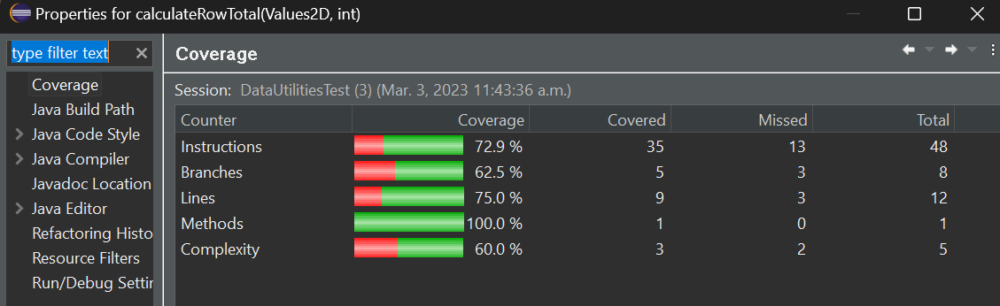
 

**^Unreachable block of code accounts for missing coverage**
 
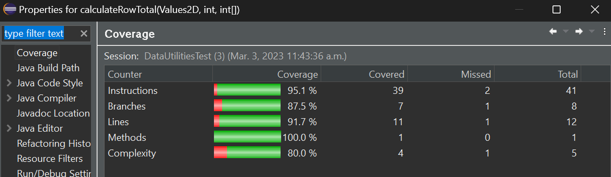
 
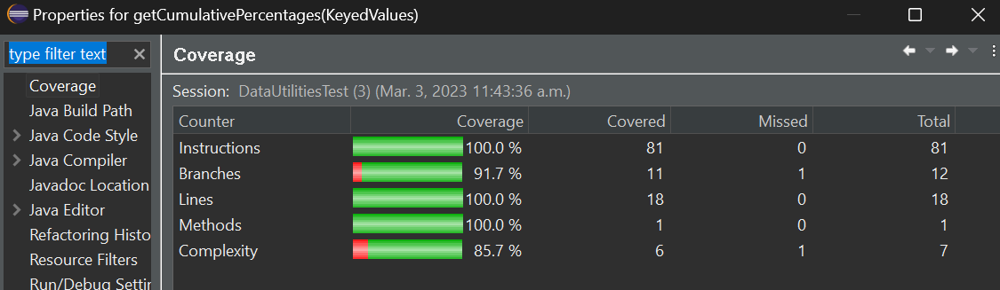
 
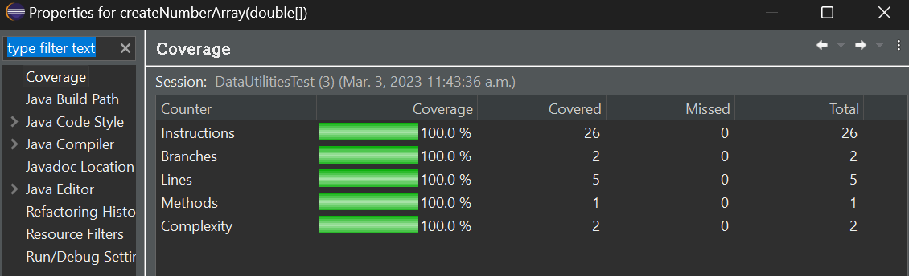
 
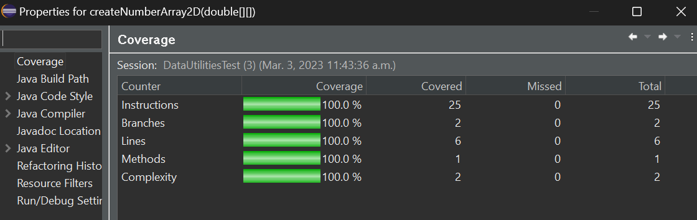
 
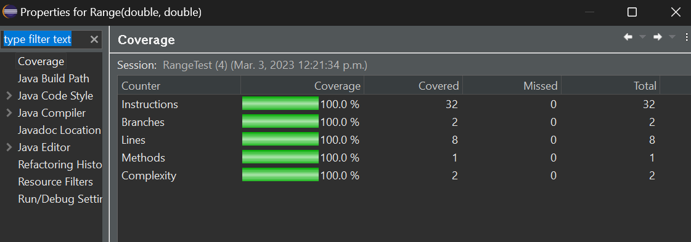
 
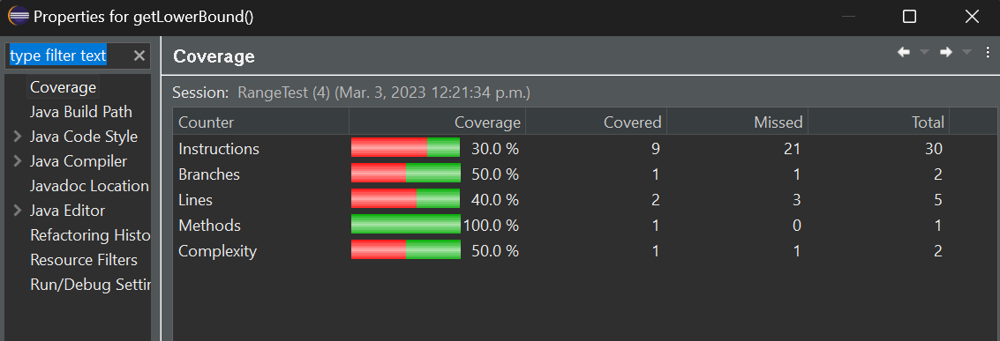
 

**^Unreachable block of code accounts for missing coverage**
 
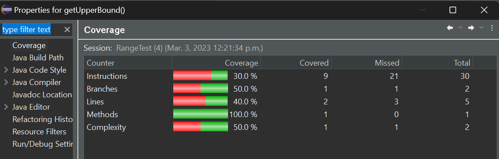
 

**^Unreachable block of code accounts for missing coverage**
 
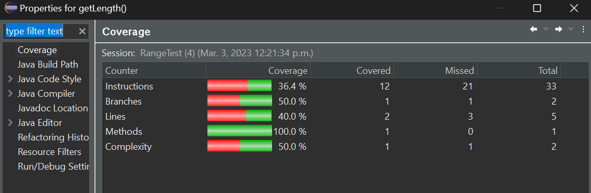
 

**^Unreachable block of code accounts for missing coverage**
 
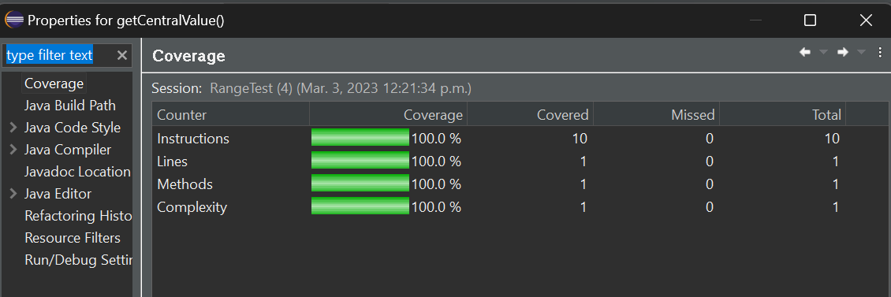
 

# 6 Pros and Cons of coverage tools used and Metrics you report

Our group experimented with Eclemma and CodeCover.

Eclemma:
- Pros
  - Native to Eclipse
  - Easy to navigate
- Cons
  - Does not support condition coverage or data-pair coverage

CodeCover:
- Pros
  - Supports branch, condition, statement, and loop coverage
- Cons
  - Large overhead cost of installing and setting up in Eclipse
  - Not compatible with all versions of Eclipse
  - Overhead cost of learning how to use interface

# 7 A comparison on the advantages and disadvantages of requirements-based test generation and coverage-based test generation.

Requirements based:

- Pros:
  - Does not require access to source code or understanding of how SUT was implemented
  - Requires less analysis
- Cons:
  - Less accurate assessment of code
  - Possible to miss certain branches, conditions, and other edge cases

Coverage based:
- Pros:
  - Higher likelihood of bug detection
  - More information about SUT (less ambiguity about functionality, may clarify confusion about requirements)

- Cons:
  - May be more time consuming
  - May require coverage software
  - Coverage may not be accurate due to unreachable blocks of code

# 8 A discussion on how the team work/effort was divided and managed

Each team member was responsible for achieving required method, statement, and branch coverage for a set of methods they 
selected from the previous assignment.  Members were to use Eclemma to measure coverage and write tests as necessary to
improve upon their portion of the test suite.

In addition, Ernest and Dyson each performed manual data coverage analysis of a method, Truman wrote/formatted the lab
report, and Rodrigo assisted with remaining work such as writing additional test(s), peer review, and ensuring that
the test suite met the coverage criteria.

# 9 Any difficulties encountered, challenges overcome, and lessons learned from performing the lab

- Troubleshooting eclemma, testing other coverage software such as CodeCover.  In order to maximise efficiency across the group and ensure compatibility with different versions of Eclipse, we chose to use the native eclemma plugin.
- We were unable to meet coverage criteria for certain methods, and assessed the source code to discover that there existed several unreachable and unuseful blocks of code within these methods

# 10 Comments/feedback on the lab itself

- Instructions and requirements (ie. coverage criteria required) unclear
- Hamcrest version provided is incompleted and created compilation issues
